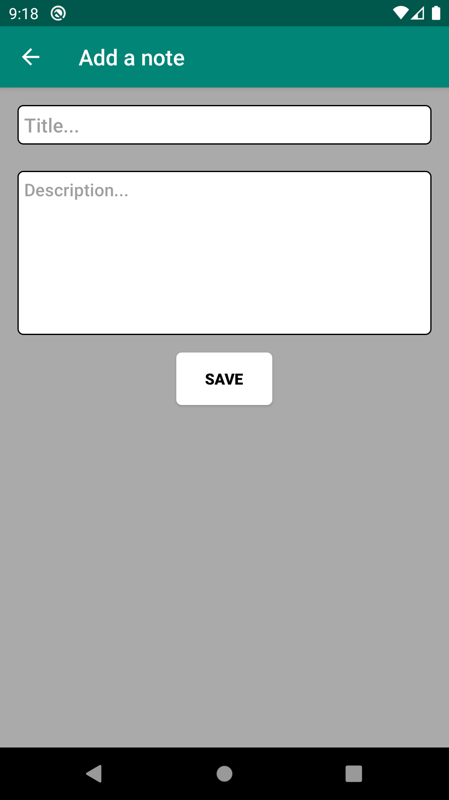
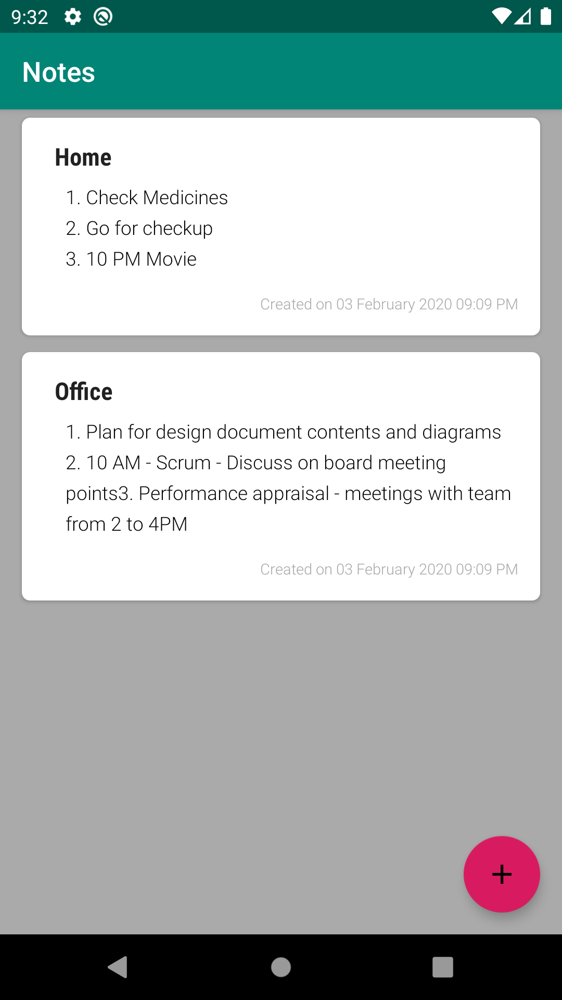
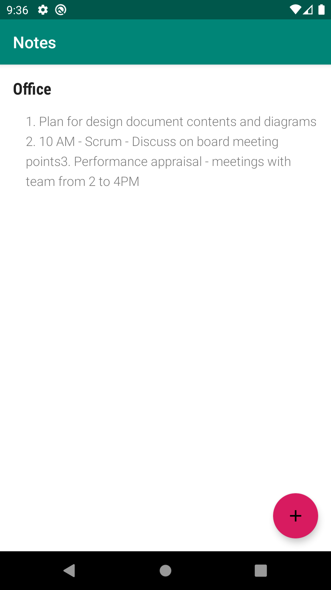

Notes
======
Notes is a basic application developed for Android users who can take notes of personal, official and save it for their future reminders.

One can merely add a note, view the list of notes and note detail. Hence it has 3 screens. 

1. Add a note
2. View notes
3. View a note detail

Details are below: 

1.Add a note
------------
This screen lets the user add a note. 
 Title - Title has 100 characters long limit
 Description - No limit on this field.
 
On clicking Save, None of the fields can be empty. Validation is applied on above input fields. On successful validation of fields, the user is taken back to the list screen.
	

2.View notes
------------
This is the app landing page. One can see the list of notes created in chronological order(latest created first). App is preloaded with some sample contents. 

3.Note detail
-------------
On tapping a note, note details screen is displayed. 

Setup Instructions:
------------------

1. Clone https://github.com/vijimscse/Notes.git from Git. 
2. Create an AVD of Phone/Tablet configuration or connect to a device through usb cable. Phone must be enabled USB debugging
Device will be shown on the connected devices list once it becomes online. Run the app and check on the emulator or device.
3. That’s all. There you go!! Happy Noting...
